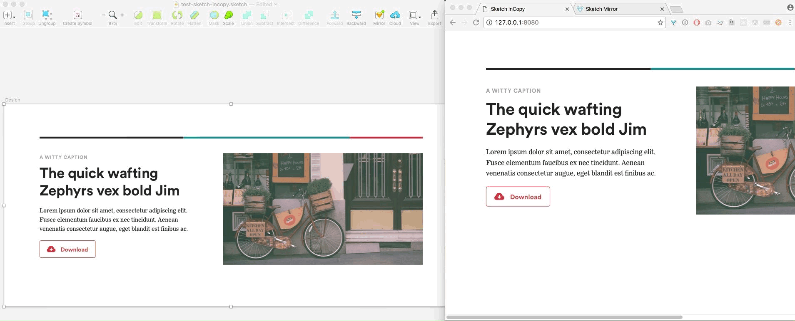

# Sketch inCopy Plugin (PoC)
A simple Proof-of-Concept plugin for Sketch 3 that will let you collaborate with Copy Editors over the Web in realtime, similar to the inCopy/inDesign workflow.

## Demo
#### Designer (left), Copy Editor (right)

## Installation
`npm install`

## Usage
1. Open a Sketch file
2. `npm start`
3. Visit `http://localhost:8080`
4. Refresh until the WebSocket handshake is successful
5. Go back to Sketch and click the `Mirror` Icon
6. Accept the connection from `Sketch inCopy`

## Todo
1. Port to nw or electron
2. Port view to React
3. Add a UI for WebSocket connecting/reconnecting
4. Add a UI to select artboards and not be tied to currentArtboard
5. Add a way to keep a history of changes
6. Don't rely on both clients being available (async updates)
7. lots of clean-up
8. idk, some more probably
